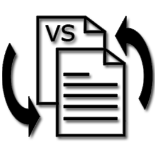

# ioBroker.ViewSwitch

# !!!  Not functional yet, could damage your Iobroker Installation  !!!

## viewswitch adapter for ioBroker

Viewswitch ist ein Adapter für ioBroker. 
Mit dem Adapter lassen sich automatische Seitenwechsel der vorhandenen Views eines Projekts realisieren. Nachdem eine View als Home (Hauptseite) bestimmt wurde, wechselt der Adapter nach Ablauf einer vorher eingestellten Zeit auf die konfigurierte HomeView zurück. Des Weiteren ist es möglich eine beliebige View als LockView (Sperrbildschirm) zu definieren und so beispielsweise bei aktiver Alarmanlage das bedienen der Vis zu sperren.

Für jede View ist die Anzeigezeit separat einstellbar.

//.....

## Changelog

### 0.0.1
* (Peoples) initial release

## License
MIT License

Copyright (c) 2020 Peoples <peoples0815github@gmail.com>

Permission is hereby granted, free of charge, to any person obtaining a copy
of this software and associated documentation files (the "Software"), to deal
in the Software without restriction, including without limitation the rights
to use, copy, modify, merge, publish, distribute, sublicense, and/or sell
copies of the Software, and to permit persons to whom the Software is
furnished to do so, subject to the following conditions:

The above copyright notice and this permission notice shall be included in all
copies or substantial portions of the Software.

THE SOFTWARE IS PROVIDED "AS IS", WITHOUT WARRANTY OF ANY KIND, EXPRESS OR
IMPLIED, INCLUDING BUT NOT LIMITED TO THE WARRANTIES OF MERCHANTABILITY,
FITNESS FOR A PARTICULAR PURPOSE AND NONINFRINGEMENT. IN NO EVENT SHALL THE
AUTHORS OR COPYRIGHT HOLDERS BE LIABLE FOR ANY CLAIM, DAMAGES OR OTHER
LIABILITY, WHETHER IN AN ACTION OF CONTRACT, TORT OR OTHERWISE, ARISING FROM,
OUT OF OR IN CONNECTION WITH THE SOFTWARE OR THE USE OR OTHER DEALINGS IN THE
SOFTWARE.